# EVMS Mobile App - Employee Vaccination Management System

A production-ready React Native mobile application for managing employee vaccinations with role-based access control, real-time updates, and comprehensive CRUD operations.

## Process

```mermaid
          graph TB
          Start([🎬 Old YouTube Video<br />Android + REST API + Heroku])

          Start --> Analyze[🤔 Analyze with Claude AI<br />What's modern in 2025?]

          Analyze --> Decision{🔀 Technology Choice}

          Decision -->|Winner| RN[⚛️ React Native<br />Cross-platform FTW]
          Decision -->|Alternative| Android[🤖 Android Studio<br />Jetpack Compose]

          RN --> Modern[✨ Modern Stack Selection]

          Modern --> Stack1[🔐 Firebase Auth<br />Social Login + Email]
          Modern --> Stack2[🗄️ Supabase<br />PostgreSQL + GraphQL]
          Modern --> Stack3[📱 React Native + Expo<br />iOS + Android + Web]

          Stack1 & Stack2 & Stack3 --> Script[📝 Generate Bolt.new Script<br />Production-ready prompt]

          Script --> Bolt[⚡ Bolt.new AI<br />Code Generation]

          Bolt --> Magic[🎨 Generated App]

          Magic --> Features1[✅ Login/Register UI]
          Magic --> Features2[✅ CRUD Operations]
          Magic --> Features3[✅ Role-based Access]
          Magic --> Features4[✅ Real-time Updates]

          Features1 & Features2 & Features3 & Features4 --> Test[🧪 Test & Deploy]

          Test --> Result([🚀 Production App<br />iOS + Android Ready!])

          style Start fill:#ef4444,stroke:#991b1b,stroke-width:3px,color:#fff
          style Analyze fill:#3b82f6,stroke:#1e40af,stroke-width:3px,color:#fff
          style RN fill:#22c55e,stroke:#15803d,stroke-width:3px,color:#fff
          style Script fill:#f59e0b,stroke:#b45309,stroke-width:3px,color:#fff
          style Bolt fill:#8b5cf6,stroke:#6d28d9,stroke-width:3px,color:#fff
          style Magic fill:#ec4899,stroke:#be185d,stroke-width:3px,color:#fff
          style Result fill:#10b981,stroke:#047857,stroke-width:4px,color:#fff
```


## Tutorial
<a  href="http://www.youtube.com/watch?feature=player_embedded&v=vXQ3cQefvZU"  target="_blank"></a>

## Features

- **Authentication**: Secure email/password authentication with Supabase
- **Role-Based Access Control**: Admin and User roles with different permissions
- **Vaccination Management**: Full CRUD operations for vaccination types
- **Real-Time Updates**: Automatic data refresh with Supabase Realtime
- **Search & Filter**: Search vaccination types by title
- **Responsive UI**: Beautiful, mobile-first design with smooth interactions
- **Error Handling**: Comprehensive error messages and user feedback
- **TypeScript**: Fully typed for better development experience

## Tech Stack

- **React Native** with Expo SDK 54
- **Expo Router** for navigation
- **Supabase** for authentication and database
- **Zustand** for state management
- **TypeScript** for type safety
- **Lucide Icons** for UI icons

## Project Structure

```
├── app/
│   ├── (auth)/                 # Authentication screens
│   │   ├── login.tsx
│   │   └── register.tsx
│   ├── (app)/                  # Main app screens
│   │   ├── (tabs)/             # Tab-based navigation
│   │   │   ├── home.tsx
│   │   │   └── vaccinations.tsx
│   │   ├── vaccination/        # Detail screen
│   │   ├── create-vaccination.tsx
│   │   └── edit-vaccination/   # Edit screen
│   └── _layout.tsx             # Root layout with auth routing
├── components/                 # Reusable UI components
│   ├── Button.tsx
│   ├── Input.tsx
│   ├── Card.tsx
│   └── LoadingSpinner.tsx
├── lib/
│   ├── supabase.ts            # Supabase client setup
│   ├── auth-store.ts          # Zustand auth store
│   ├── vaccination-service.ts # API service for vaccinations
│   └── seed-demo-data.ts      # Demo data seeding
└── hooks/                      # Custom React hooks

```

## Getting Started

### Prerequisites

- Node.js 18+ and npm
- Expo CLI (optional, can use `npx expo`)
- iOS Simulator (Mac) or Android Emulator, or Expo Go app on physical device

### Installation

1. **Install Dependencies**
```bash
npm install
```

2. **Environment Setup**
The `.env` file is already configured with Supabase credentials. No additional setup required.

### Running the App

Start the development server:
```bash
npm run dev
```

Then:
- Press `w` to open in web browser
- Press `i` to open in iOS Simulator (Mac only)
- Press `a` to open in Android Emulator
- Scan QR code with Expo Go app on your phone

## Demo Credentials

Use these accounts to test the app:

**Admin Account:**
- Email: `admin@example.com`
- Password: `password123`
- Permissions: Create, edit, and delete vaccination types

**Regular User Account:**
- Email: `user@example.com`
- Password: `password123`
- Permissions: View vaccination types only

## Database Schema

### Users Table
- `id`: UUID primary key
- `email`: Unique email address
- `display_name`: User's display name
- `role`: 'admin' or 'user'
- `created_at`: Timestamp
- `last_login`: Last login timestamp

### Vaccination Types Table
- `id`: UUID primary key
- `title`: Vaccination type name (unique)
- `description`: Detailed description
- `created_by`: Foreign key to users
- `created_at`: Creation timestamp
- `updated_at`: Last update timestamp

## Security Features

- **Row Level Security (RLS)**: Database-level access control
- **Authentication**: Supabase Auth with secure password hashing
- **Role-Based Access**: Admin-only operations for modifications
- **Type Safety**: TypeScript strict mode for compile-time safety

## Key Screens

### Login Screen
- Email and password input fields
- Demo credentials displayed
- Link to registration
- Form validation with error messages

### Register Screen
- Full name, email, password fields
- Password confirmation
- Form validation
- Link to login

### Home Screen
- Welcome message with user name
- Role badge (Admin/User)
- Vaccination type count
- Quick access to vaccinations
- Sign out option

### Vaccinations List Screen
- Search functionality
- Pull-to-refresh
- Vaccination type cards with details
- Admin-only edit and delete buttons
- Create new button (admin only)
- Empty state with CTA

### Vaccination Detail Screen
- Full vaccination information
- Creation date and metadata
- Edit/Delete buttons (admin only)
- Back navigation

### Create/Edit Screens
- Form with title and description
- Character counter
- Validation with error messages
- Save and cancel buttons

## Available Scripts

```bash
# Start development server
npm run dev

# Run TypeScript type checking
npm run typecheck

# Run ESLint
npm run lint

# Build for web
npm run build:web
```

## API Reference

### Authentication
- `signUp(email, password, displayName)`: Register new user
- `signIn(email, password)`: Log in user
- `signOut()`: Log out user
- `fetchUser()`: Get current user info

### Vaccinations
- `getAll()`: Fetch all vaccination types
- `getById(id)`: Get specific vaccination type
- `create(title, description, createdBy)`: Create new vaccination type
- `update(id, description)`: Update vaccination type
- `delete(id)`: Delete vaccination type
- `search(query)`: Search vaccination types
- `subscribeToChanges(callback)`: Subscribe to real-time updates

## State Management

### Auth Store (Zustand)
Manages authentication state:
- `user`: Current user object
- `session`: Auth session
- `loading`: Loading state
- `error`: Error messages
- `isAdmin`: Admin privilege flag

### Local State
Component-level state for UI:
- Form inputs and validation
- Loading and refreshing states
- Vaccination list data

## Error Handling

The app handles various error scenarios:
- Network errors with user-friendly messages
- Authentication failures
- Database operation errors
- Form validation errors
- Empty states with helpful CTAs

## Testing

Manual testing checklist:
- [ ] Register new account
- [ ] Login with email/password
- [ ] View vaccination list
- [ ] Search vaccinations (admin)
- [ ] Create new vaccination (admin)
- [ ] Edit vaccination (admin)
- [ ] Delete vaccination (admin)
- [ ] Verify regular user cannot modify
- [ ] Pull-to-refresh functionality
- [ ] Sign out and navigate to login

## Troubleshooting

### App won't start
```bash
npm install
npm run dev
```

### Type errors
```bash
npm run typecheck
```

### Clear cache and reinstall
```bash
rm -rf node_modules package-lock.json
npm install
npm run dev
```

### Supabase connection issues
Check that environment variables are set correctly in `.env`:
- `EXPO_PUBLIC_SUPABASE_URL`
- `EXPO_PUBLIC_SUPABASE_ANON_KEY`

## Performance Optimizations

- **Memoization**: Components wrapped with React.memo
- **List Virtualization**: FlatList for efficient rendering
- **Lazy Loading**: Screens loaded on demand
- **Image Caching**: Images cached by React Native
- **Code Splitting**: Separate route chunks

## Accessibility

- **WCAG 2.1 Compliant**: Proper color contrast
- **Touch Targets**: Minimum 44x44pt buttons
- **Labels**: All inputs have descriptive labels
- **Focus Management**: Proper navigation focus

## Future Enhancements

- Employee vaccination records
- Batch upload functionality
- PDF report generation
- Email notifications
- Advanced analytics
- Multi-language support
- Dark mode theme
- Biometric authentication

## Contributing

1. Create a new branch for your feature
2. Make changes and test thoroughly
3. Run type checking: `npm run typecheck`
4. Commit with descriptive message
5. Push and create pull request

## License

MIT License - feel free to use this project for your needs

## Support

For issues and questions:
1. Check the troubleshooting section
2. Review Supabase documentation
3. Check React Native documentation
4. Open an issue with detailed information

---

**Happy coding! Build something amazing with EVMS.**
